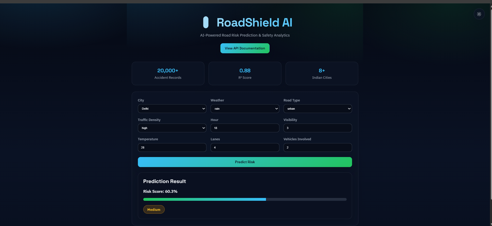
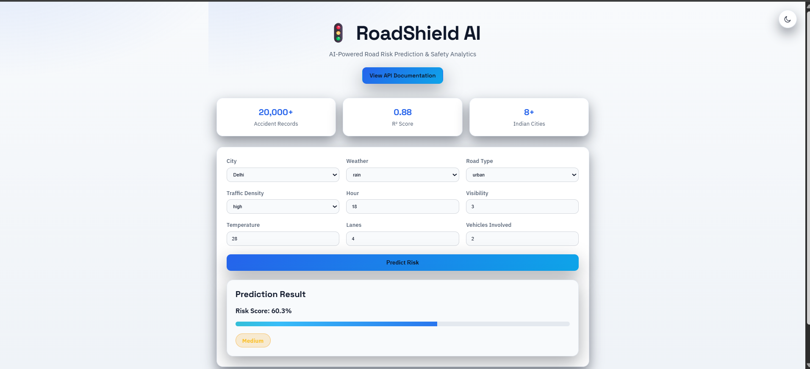
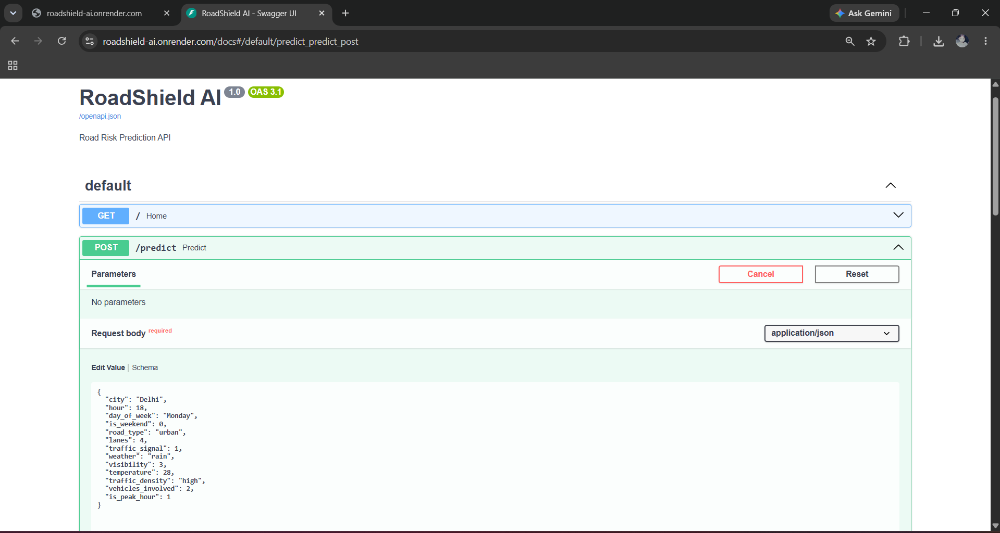
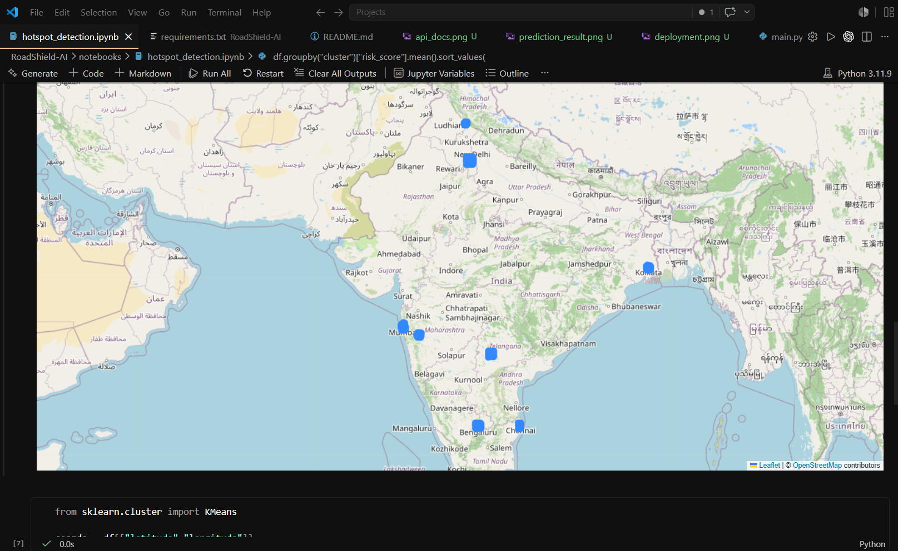
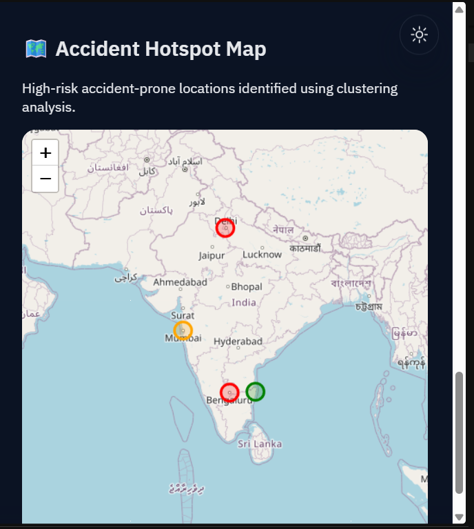
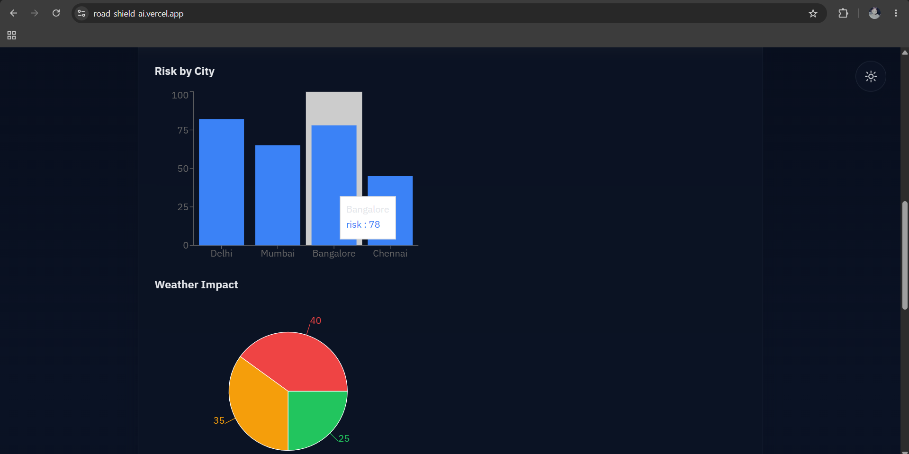

# SafetyROI 🚦

AI-powered Road Risk Prediction and Hotspot Detection System for Indian Roads.


---

## Overview

SafetyROI is a machine learning-powered road safety platform that analyzes accident-related factors such as weather conditions, traffic density, visibility, road type, temperature, and peak-hour traffic patterns to estimate road risk levels and identify accident hotspots.

The project combines Machine Learning, FastAPI, React, and Geospatial Visualization to support road safety analysis, smart city planning, and accident prevention through predictive analytics.

---

## Key Achievements

* Built and deployed a full-stack AI application using React and FastAPI
* Achieved an **R² Score of 0.88** using Random Forest Regression
* Developed and deployed REST APIs on Render
* Built a responsive dashboard with Dark/Light mode support
* Integrated frontend and backend through real-time prediction APIs
* Added interactive accident hotspot visualization using React Leaflet
* Deployed frontend on Vercel and backend on Render
* Implemented Explainable AI using risk-factor attribution
* Integrated real-time weather intelligence using OpenWeather API
* Generated contextual AI safety recommendations
* Built interpretable accident-risk explanations for end users

---

## Portfolio Highlights

- End-to-end AI/ML project with production deployment
- Full-stack architecture using React and FastAPI
- Interactive geospatial visualization with Leaflet
- Machine Learning model with R² score of 0.88
- Cloud deployment using Vercel and Render

## Live Demo

### Frontend Application

🔗 https://road-shield-ai.vercel.app

### Backend API

🔗 https://roadshield-ai.onrender.com

### API Documentation

🔗 https://roadshield-ai.onrender.com/docs

---

## Features

* Road Risk Score Prediction using Machine Learning
* Accident Hotspot Detection using Clustering
* Interactive Accident Hotspot Map
* Interactive Geospatial Visualization using React Leaflet
* Exploratory Data Analysis (EDA)
* Feature Importance Analysis
* FastAPI REST API
* React Frontend Dashboard
* Dark / Light Mode Support
* Real-Time Risk Prediction
* Public Cloud Deployment (Render + Vercel)
* Swagger API Documentation
* AI Safety Recommendations
* Live Weather Integration (OpenWeather API)
* Weather-Aware Risk Prediction
* Risk Factor Breakdown (Explainable AI)
* AI-Powered Risk Explanation Engine

---

## Dataset

* Indian Road Accident Dataset (2022–2025)
* 20,000 Accident Records
* Multiple Indian Cities
* Weather, Traffic, Visibility, Road Infrastructure, and Temporal Features
* Risk Score Information

---

## Machine Learning Results

### Risk Score Prediction

**Model:** Random Forest Regressor

### Performance

| Metric   | Value |
| -------- | ----- |
| R² Score | 0.88  |
| MAE      | 0.056 |

### Most Important Features

| Feature         | Importance |
| --------------- | ---------- |
| Visibility      | 30.4%      |
| Traffic Density | 28.2%      |
| Weather         | 23.1%      |
| Peak Hour       | 8.0%       |
| Temperature     | 2.2%       |

---

## API Example

### Request

```json
{
  "city": "Delhi",
  "hour": 18,
  "day_of_week": "Monday",
  "is_weekend": 0,
  "road_type": "urban",
  "lanes": 4,
  "traffic_signal": 1,
  "weather": "rain",
  "visibility": 3,
  "temperature": 28,
  "traffic_density": "high",
  "vehicles_involved": 2,
  "is_peak_hour": 1
}
```

### Response

```json
{
  "risk_score": 0.603,
  "risk_level": "Medium",
  "recommendations": [
    "Reduce speed and maintain safe braking distance.",
    "Use headlights and stay alert in low visibility."
  ],
  "explanation": "This route has a medium accident risk because rainy weather, low visibility (3 km), high traffic density, and peak-hour traffic are significant factors that increase the likelihood of road incidents.",
  "risk_factors": {
    "Visibility": "30.4%",
    "Traffic Density": "28.2%",
    "Weather": "23.1%",
    "Peak Hour": "8.0%"
  }
}
```

---

## Screenshots

### Dashboard (Dark Mode)



### Dashboard (Light Mode)



### API Documentation



### Accident Hotspot Detection



### Interactive Hotspot Map



### Risk Analytics Dashboard



---

## Project Structure

```text
SafetyROI/
│
├── backend/
│   ├── main.py
│   ├── schemas.py
│   ├── encoders.py
│   ├── model_loader.py
│   └── requirements.txt
│
├── frontend/
│   ├── src/
│   ├── public/
│   ├── components/
│   └── package.json
│
├── data/
├── docs/
├── models/
│   └── risk_model.pkl
│
├── notebooks/
│   ├── EDA.ipynb
│   ├── risk_model.ipynb
│   └── hotspot_detection.ipynb
│
├── screenshots/
│
├── render.yaml
├── README.md
└── requirements.txt
```

---

## Local Setup

### Clone Repository

```bash
git clone https://github.com/shivaamsingh/SafetyROI.git
cd SafetyROI
```

### Backend Setup

```bash
pip install -r requirements.txt
uvicorn backend.main:app --reload
```

Backend:

```text
http://localhost:8000
```

API Documentation:

```text
http://localhost:8000/docs
```

### Frontend Setup

```bash
cd frontend
npm install
npm install react-leaflet leaflet
npm run dev
```

Frontend:

```text
http://localhost:5173
```

### Production Deployment

Frontend (Vercel)

```text
https://road-shield-odtoybjiy-shiivamsingh.vercel.app
```

Backend (Render)

```text
https://roadshield-ai.onrender.com
```

---

## Project Status

✅ Data Collection

✅ Exploratory Data Analysis

✅ Risk Prediction Model

✅ Accident Hotspot Detection

✅ FastAPI Backend

✅ React Frontend Dashboard

✅ Interactive Hotspot Map

✅ Dark / Light Mode Support

✅ Public API Deployment

✅ Swagger API Documentation

✅ Frontend Deployment (Vercel)

✅ Weather API Integration

✅ AI Safety Recommendations

✅ AI Risk Explanation Engine

✅ Risk Factor Breakdown (Explainable AI)

✅ Live Weather Integration


🔄 Real-Time Route Risk Prediction

🔄 Live Traffic Analytics

---

## Future Improvements

* Live Traffic Data Integration
* Route-Level Risk Prediction
* City-Wise Risk Analytics Dashboard
* GPS-Based Risk Monitoring
* Mobile Application
* Docker Deployment
* CI/CD Pipeline
* User Authentication
* Historical Risk Trend Analysis

---

## Tech Stack

### Backend

* Python
* FastAPI
* Uvicorn

### Machine Learning

* Pandas
* NumPy
* Scikit-Learn

### Frontend

* React
* Vite
* Axios
* React Leaflet
* Modern Responsive UI
* Dark / Light Mode

### Visualization

* Folium
* React Leaflet

### Deployment

* Render
* Vercel

---

## Author

### Shivam Singh

B.Tech CSE (AI & ML)

GitHub Profile: [@shivaamsingh](https://github.com/shivaamsingh)

Project Repository: [SafetyROI](https://github.com/shivaamsingh/SafetyROI)

---

⭐ If you found this project useful, please consider starring the repository.

Contributions, suggestions, and feedback are welcome.


Backend Section:
# SafetyROI — Backend

Road Safety Intelligence System API for Problem Statement 3 (Transport:
RoadSafe India). FastAPI + pandas + scikit-learn, serving JSON and
HTMX-ready HTML fragments.

## Quickstart

```bash
python -m venv .venv && source .venv/bin/activate      # optional but recommended
pip install -r requirements.txt
uvicorn app.main:app --reload --port 8000
```

Then open `http://localhost:8000/docs` for interactive Swagger docs, or
`http://localhost:8000/` for a health check.

Seed data is generated automatically into `data_files/*.csv` on first
run (see "Data" below) — no manual setup step needed.

## Project layout

```
app/
  data/
    reference.py       # static reference tables (states, population,
                        # cause/mode/age taxonomies, cause->intervention
                        # knowledge base + cost table, city coordinates)
    seed_generator.py  # generates synthetic seed CSVs matching the
                        # real MoRTH/NCRB/data.gov.in schema
    ingestion.py        # cleaning + standardization + merge/validation
    store.py            # in-memory pandas store, loaded at startup
  models/
    risk_scoring.py     # 0-100 risk score, explainable weighted formula
    forecasting.py      # linear regression / moving-average forecast
    causes.py            # cause breakdown for a state
    interventions.py    # cause -> intervention recommendation + ranking
    impact.py            # pattern-based impact estimate per intervention
    allocation.py        # budget-constrained greedy allocator (flagship)
    vulnerability.py    # mode-of-transport + age-band breakdown
    seasonal.py          # month/season risk flags
    mapping.py            # Plotly choropleth (+ bar-chart fallback)
  api/
    routes_*.py          # FastAPI routers, one per feature area
    render.py             # Jinja2 HTML-fragment rendering for HTMX
  templates/             # plain semantic HTML fragments (unstyled —
                          # frontend owns visual design)
  schemas.py              # Pydantic request models
  main.py                  # app assembly, CORS, startup data load
data_files/               # generated seed CSVs (see schema below)
requirements.txt
```

## API reference

All endpoints accept `?format=html` to receive an HTMX-swappable HTML
fragment instead of JSON (default `format=json`).

| Endpoint | Method | Notes |
|---|---|---|
| `/api/risk-scores` | GET | `?year=` optional. 0-100 score per state + reasoning + formula/weights. |
| `/api/risk-map` | GET | `?year=&include_city_markers=&top_n_cities=`. Returns embeddable Plotly HTML. |
| `/api/causes/{state}` | GET | `?year=` optional. Cause breakdown, ranked. |
| `/api/forecast/{state}` | GET | `?horizon=1..5`. Linear-regression accident forecast with R². |
| `/api/interventions/{state}` | GET | `?year=&top_n=`. Ranked intervention recommendations. |
| `/api/impact-estimate/{state}` | GET | `?year=`. Pattern-based impact % + lives-saved estimate per intervention. |
| `/api/allocate-budget` | POST | Body: `{total_budget_lakhs, states?, year?}`. **Flagship** — cross-state greedy allocation by lives-saved-per-rupee. |
| `/api/vulnerability/{state}` | GET | `?year=`. Mode-of-transport + age-band breakdown. |
| `/api/seasonal-risk/{state}` | GET | Month-level relative risk index + high-risk-month flags. |
| `/api/meta/states` | GET | List of covered states + available years. |
| `/api/meta/summary` | GET | National headline stats for the landing page. |

Every risk/score endpoint includes a `reasoning` or `methodology` /
`disclosure` field explaining *why* the number is what it is — this is
intentional per the "intelligence system, not a stats API" framing in
the problem statement, and per the requirement to be explicit that
impact estimates are pattern-based, not causal.

## Data

**No real dataset file was supplied with this build**, so
`seed_generator.py` produces internally-consistent synthetic data
shaped like the real sources (state/UT + year accident/fatality/injury
counts with a COVID-19 dip in 2020, cause-wise shares, mode-of-transport
shares, age-band shares, city-level series, and a seasonal index) with
a fixed random seed for reproducibility.

**To use real data**, drop CSVs into `data_files/` with these exact
filenames/columns and the ingestion pipeline will pick them up in
place of the generated seed (delete the seed CSV first if it already
exists, since ingestion only generates when the file is missing):

| File | Columns |
|---|---|
| `accidents_state_year.csv` | `state, year, accidents, fatalities, injuries, population_lakhs` |
| `causes_state_year.csv` | `state, year, cause, share` (cause names must match `reference.CAUSES`, shares should sum to ~1 per state-year) |
| `modes_state_year.csv` | `state, year, mode, share` (mode names must match `reference.MODES_OF_TRANSPORT`) |
| `vulnerability_age_state_year.csv` | `state, year, age_band, share` (bands must match `reference.AGE_BANDS`) |
| `accidents_city_year.csv` | `city, state, year, accidents, fatalities` |
| `seasonal_state_month.csv` | `state, month, relative_risk_index` |

`ingestion.py` standardizes state-name variants (Orissa→Odisha,
Pondicherry→Puducherry, J&K→Jammu and Kashmir, etc.) and re-normalizes
cause shares if they drift from summing to 1.

## Design notes / honesty disclosures baked into the API

- **Risk score** is a transparent weighted formula (40% accident rate,
  40% fatality rate, 20% YoY trend), min-max normalized across states
  for the selected year. Weights are returned in every response.
- **Forecast** is deliberately simple (OLS linear regression, falling
  back to a flat forecast under 3 data points) per the spec's
  "don't overfit" instruction — R² and slope are always returned.
- **Impact estimate** is explicitly labeled pattern-based /
  correlational (a literature-informed baseline effectiveness per
  countermeasure type, nudged by a cross-sectional correlation found in
  this dataset) — never presented as a causal, experimentally-verified
  number.
- **Budget allocation** is a greedy 0/1 knapsack by lives-saved-per-rupee
  — fast and auditable, explicitly not claimed to be globally optimal.
- **Risk map** falls back to a ranked bar chart if an India state
  GeoJSON can't be loaded (no bundled file, tries a public URL, then
  falls back) so the endpoint never hard-fails offline.

## Running tests / sanity checks

```bash
python -m app.data.seed_generator     # regenerate seed CSVs
python -c "from app.data.ingestion import load_all; print({k: v.shape for k, v in load_all().items()})"
```
